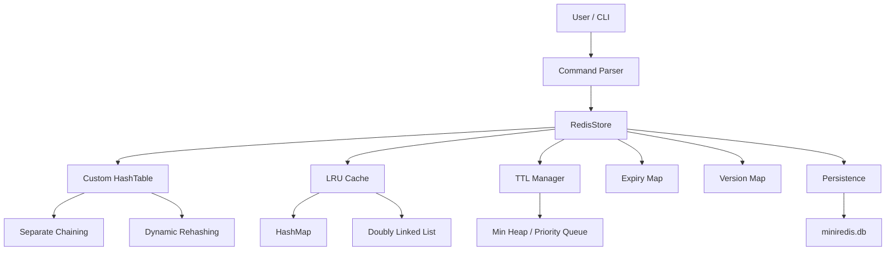

# MiniRedis — Redis-Inspired In-Memory Key-Value Store

A C++ implementation of a Redis-inspired in-memory key-value database built from scratch to explore core data structures, memory management, caching, TTL-based expiration, persistence, and performance engineering.

> **Project focus:** implementing the underlying data structures and system components instead of relying on ready-made database/cache implementations.

---

## 📌 Overview

MiniRedis provides a command-line interface for storing and retrieving key-value pairs in memory.

The system includes:

- Custom Hash Table with separate chaining
- Dynamic rehashing
- TTL-based key expiration
- Min-heap based expiration scheduling
- Versioning to prevent stale TTL entries from deleting valid keys
- LRU cache
- File-based persistence
- TTL restoration after restart
- Command parser and interactive CLI
- Performance benchmarks
- Rehashing benchmark
- Edge-case and persistence testing

The project is designed around a simple principle:

```text
HashTable  → Source of truth
LRU Cache  → Performance optimization
TTLManager → Expiration scheduling
Persistence → Disk storage
RedisStore → System orchestration
CommandParser → User input handling
```

---

# 🎯 Why I Built This

The goal was to understand how an in-memory database can be designed internally using fundamental data structures.

Instead of treating a database as a black box, this project explores:

- How hash tables store and retrieve data
- How collisions are handled
- Why dynamic resizing is required
- How TTL expiration can be scheduled efficiently
- How stale expiration events can be detected
- How an LRU cache achieves O(1) operations
- How in-memory state can be persisted to disk
- How benchmarking can reveal real implementation bugs
- How different components interact inside a storage system

---

# 🏗️ Architecture



## Component Responsibilities

| Component | Responsibility |
|---|---|
| `CommandParser` | Tokenizes and validates CLI commands |
| `RedisStore` | Coordinates storage, TTL, cache and persistence |
| `HashTable` | Primary in-memory key-value storage |
| `TTLManager` | Tracks keys scheduled for expiration |
| `LRUCache` | Keeps recently used values for fast access |
| `Persistence` | Saves and loads data from disk |
| `expiryMap` | Stores absolute expiration timestamps |
| `versionMap` | Invalidates stale TTL events |

---

# 🔄 Command Flow

For a normal command:

```text
User
 ↓
Command Parser
 ↓
RedisStore
 ↓
HashTable
 ↓
Response
```

For a TTL-based SET:

```text
User
 ↓
Command Parser
 ↓
RedisStore
 ├── HashTable
 ├── LRU Cache
 ├── Expiry Map
 ├── Version Map
 └── TTL Manager
        ↓
     Min Heap
```

---

# 🧩 Core Components

## 1. Custom HashTable

The primary storage engine is a custom hash table.

### Collision Handling

Separate chaining is used to handle collisions.

Each bucket stores a linked list:

```text
Bucket 0 → Node → Node → nullptr
Bucket 1 → nullptr
Bucket 2 → Node → nullptr
...
```

Each node stores:

```text
key
value
next
```

### Lookup

For `GET key`:

1. Hash the key.
2. Convert the hash into a bucket index.
3. Traverse the bucket's linked list.
4. Compare keys.
5. Return the matching value.

Average complexity:

```text
GET → O(1)
```

Worst case:

```text
GET → O(N)
```

when many keys collide into the same bucket.

---

# 🔁 Dynamic Rehashing

The hash table monitors its load factor:

```text
load factor = number of elements / capacity
```

The implementation triggers rehashing when:

```text
load factor >= 0.75
```

The capacity is doubled:

```text
10
 ↓
20
 ↓
40
 ↓
80
 ↓
...
```

During rehashing:

1. A new table with double capacity is created.
2. Existing nodes are traversed.
3. Each key is hashed again using the new capacity.
4. Nodes are moved into their new buckets.

A single rehash costs:

```text
O(N)
```

However, because resizing happens only occasionally and capacity doubles, insertion remains:

```text
Amortized O(1)
```

---

# ⏳ TTL Management

MiniRedis supports:

```text
SET key value EX seconds
```

Example:

```text
SET session abc123 EX 60
```

Instead of storing only the duration, the system calculates an absolute Unix timestamp:

```text
expiryTime = currentTime + TTL
```

This makes expiration checks independent of when the key was inserted.

---

# 🏔️ Min Heap for Expiration

TTL entries are maintained using:

```cpp
priority_queue<Expiry, vector<Expiry>, CompareExpiry>
```

configured as a min heap.

The earliest expiration remains at the top:

```text
          10s
         /   \
       20s   30s
      /  \
    40s  50s
```

This allows the system to efficiently identify the next key that may expire.

### Complexity

| Operation | Complexity |
|---|---:|
| Add expiry | O(log N) |
| Read earliest expiry | O(1) |
| Remove earliest expiry | O(log N) |

---

# 🛡️ TTL Versioning

A major problem with a simple expiration queue is **stale entries**.

Example:

```text
SET A 100 EX 10
```

creates:

```text
A → version 1
```

Then:

```text
SET A 200 EX 50
```

creates:

```text
A → version 2
```

The old version-1 entry is still present in the heap.

If the old entry expires, it must NOT delete the new value.

MiniRedis solves this using versioning:

```text
Heap Entry:
(key=A, expiry=..., version=1)

Current Version:
A → 2
```

When an expiration is processed:

```text
heap version == current version
        ↓
      valid
```

Otherwise:

```text
heap version != current version
        ↓
       stale
        ↓
     ignore it
```

This prevents an old TTL event from deleting a newer value.

---

# 🧹 Lazy Expiration

MiniRedis uses lazy expiration processing.

Expiration is checked when relevant operations occur instead of continuously running a background expiration thread.

The system checks the earliest heap entry:

```text
while heap is not empty:

    take earliest expiry

    if expiry > current time:
        stop

    if version is current:
        delete key

    remove heap entry
```

Expired keys are removed from:

```text
HashTable
LRU Cache
Expiry Map
Version Map
```

---

# ⚡ LRU Cache

The LRU cache is implemented using:

```text
unordered_map
+
Doubly Linked List
```

Architecture:

```text
HashMap
   ↓
key → Node*

Doubly Linked List:

HEAD
 ↓
MRU
 ↓
...
 ↓
LRU
 ↓
TAIL
```

### Why both structures?

The hash map provides:

```text
O(1) average lookup
```

The doubly linked list provides:

```text
O(1) insertion
O(1) deletion
O(1) movement
```

Therefore:

| Operation | Average Complexity |
|---|---:|
| GET | O(1) |
| PUT | O(1) |
| REMOVE | O(1) |
| Eviction | O(1) |

### Important Design Decision

The LRU cache is **not the source of truth**.

```text
HashTable → Source of truth
LRU Cache → Optimization
```

If a key is evicted from the LRU cache, the actual data still exists in the HashTable.

---

# 💾 Persistence

MiniRedis supports:

```text
SAVE
LOAD
```

Data is stored in a file using:

```text
key|value|expiryTime
```

For a key without TTL:

```text
key|value|-1
```

Example:

```text
A|100|-1
B|200|1760000000
```

The absolute expiration timestamp is persisted so TTL information survives a restart.

---

# 🔄 Persistence Flow

### SAVE

```text
RedisStore
    ↓
Process expired keys
    ↓
Read HashTable
    ↓
Read expiryMap
    ↓
Create PersistentEntry
    ↓
Persistence.save()
    ↓
miniredis.db
```

### LOAD

```text
miniredis.db
    ↓
Persistence.load()
    ↓
Parse entries
    ↓
Ignore already-expired entries
    ↓
Restore HashTable
    ↓
Restore LRU Cache
    ↓
Restore TTL
    ↓
Restore version information
```

---

# 🔁 TTL Restoration After Restart

Suppose:

```text
SET B 200 EX 120
SAVE
```

The database stores the absolute expiry timestamp.

After restarting MiniRedis:

```text
LOAD
```

the system compares the stored expiration timestamp with the current time.

If:

```text
expiryTime > currentTime
```

the key is restored.

If:

```text
expiryTime <= currentTime
```

the key is not restored.

This prevents expired data from coming back after a restart.

---

# 🖥️ Supported Commands

| Command | Description |
|---|---|
| `SET key value` | Store/update a key |
| `SET key value EX seconds` | Store key with TTL |
| `GET key` | Retrieve value |
| `DEL key` | Delete key |
| `EXISTS key` | Check whether key exists |
| `TTL key` | Get remaining TTL |
| `SAVE` | Persist current state |
| `LOAD` | Load persisted state |
| `EXIT` | Exit CLI |

### TTL Semantics

```text
-2 → Key does not exist
-1 → Key exists but has no TTL
>=0 → Remaining TTL in seconds
```

---

# 🧪 Edge Case Testing

The implementation was tested against cases including:

### TTL overwrite

```text
SET A 100 EX 5
SET A 200 EX 50
```

The old TTL must not delete the newer value.

### TTL removal

```text
SET A 100 EX 5
SET A 200
```

The new value should have:

```text
TTL A → -1
```

### Delete with TTL

```text
SET A 100 EX 10
DEL A
```

The key and its associated expiration state must be removed.

### LRU + TTL

Expired keys are removed from both the source storage and cache.

### Persistence

Tested that:

- Non-TTL keys survive restart.
- TTL keys survive restart with remaining expiration.
- Already-expired keys are not restored.

### Invalid persistence data

Malformed expiry values are safely ignored instead of crashing the program.

---

# 📊 Performance Benchmarks

MiniRedis includes two benchmark programs:

```text
benchmarks/
├── benchmark.cpp
└── rehash_benchmark.cpp
```

---

## Benchmark 1 — Custom HashTable vs `std::unordered_map`

The benchmark compares:

- SET
- GET
- DEL

for:

```text
N = 1,000
N = 10,000
N = 100,000
```

The custom table was initialized with approximately `2N` capacity and `std::unordered_map` was reserved similarly so that this benchmark primarily measures operation performance rather than resize overhead.

Results:

| N | Custom SET | STL SET | Custom GET | STL GET | Custom DEL | STL DEL |
|---:|---:|---:|---:|---:|---:|---:|
| 1,000 | 150 µs | 175 µs | 39 µs | 17 µs | 73 µs | 50 µs |
| 10,000 | 923 µs | 1,267 µs | 163 µs | 291 µs | 356 µs | 679 µs |
| 100,000 | 9,778 µs | 12,679 µs | 2,395 µs | 3,316 µs | 5,800 µs | 6,240 µs |

### Interpretation

Both implementations provide average:

```text
O(1)
```

hash-table operations.

The benchmark does **not** imply that the custom implementation is universally faster than `std::unordered_map`.

Actual performance depends on factors such as:

- Hash function
- Collision distribution
- Memory allocation
- Pointer traversal
- Cache locality
- Standard library implementation
- Compiler
- Hardware

The benchmark demonstrates that the custom implementation was competitive under this workload and environment.

---

# 📈 Benchmark 2 — Dynamic Rehashing

The second benchmark starts with a very small capacity:

```text
Initial Capacity = 10
```

and inserts:

```text
100,000 keys
```

The table dynamically grows through repeated doubling.

### Result

```text
Initial Capacity : 10
Total Keys       : 100000
Final Size       : 100000

Total SET time including rehashing : 13732 µs
Average SET time                   : 0.13732 µs/key
```

### What this demonstrates

Individual rehash:

```text
O(N)
```

But resizing is infrequent because the capacity doubles.

Therefore insertion remains:

```text
Amortized O(1)
```

This benchmark also validates that the hash table remains functional while repeatedly resizing.

---

# 🐛 Engineering Bug Discovered During Benchmarking

One of the most useful outcomes of the benchmark was finding a real implementation bug.

The initial hash function used a signed `int` accumulator.

With larger workloads, the hash calculation could overflow.

This produced invalid bucket indices and eventually caused a Windows access violation:

```text
0xC0000005
```

The issue was diagnosed through stress testing and benchmarking.

The hash accumulator was changed to:

```cpp
unsigned long long
```

before applying the modulo operation.

This eliminated the overflow-related invalid indexing.

### Engineering Lesson

Benchmarking was not only used to compare performance.

It also acted as a **stress test for correctness**.

```text
Implementation
      ↓
Benchmark
      ↓
Unexpected crash
      ↓
Investigate
      ↓
Identify integer overflow
      ↓
Fix hash implementation
      ↓
Re-run benchmark
```

---

# ⏱️ Complexity Analysis

| Component | Operation | Average | Worst |
|---|---|---:|---:|
| HashTable | SET | O(1) | O(N) |
| HashTable | GET | O(1) | O(N) |
| HashTable | DEL | O(1) | O(N) |
| HashTable | Rehash | — | O(N) |
| HashTable | Insert with resizing | Amortized O(1) | O(N) |
| TTL Manager | Add expiry | O(log N) | O(log N) |
| TTL Manager | Get earliest expiry | O(1) | O(1) |
| TTL Manager | Remove expiry | O(log N) | O(log N) |
| LRU Cache | GET | O(1) avg. | O(1) avg. |
| LRU Cache | PUT | O(1) avg. | O(1) avg. |
| LRU Cache | REMOVE | O(1) avg. | O(1) avg. |

---

# 🧠 Data Structures Used

| Data Structure | Purpose |
|---|---|
| Hash Table | Primary key-value storage |
| Linked List | Hash collision chains |
| Priority Queue / Min Heap | TTL scheduling |
| `unordered_map` | LRU node lookup |
| Doubly Linked List | LRU ordering |
| `unordered_map` | Expiry/version metadata |

---

# 📂 Project Structure

```text
MiniRedis/
│
├── include/
│   ├── HashTable.h
│   ├── RedisStore.h
│   ├── TTLManager.h
│   ├── LRUCache.h
│   ├── Persistence.h
│   └── CommandParser.h
│
├── src/
│   ├── HashTable.cpp
│   ├── RedisStore.cpp
│   ├── TTLManager.cpp
│   ├── LRUCache.cpp
│   ├── Persistence.cpp
│   └── CommandParser.cpp
│
├── benchmarks/
│   ├── benchmark.cpp
│   └── rehash_benchmark.cpp
│
├── main.cpp
├── README.md
└── .gitignore
```

> The exact source organization may vary depending on the repository layout.

---

# 🛠️ Build & Run

Compile the main application with a C++ compiler:

```bash
g++ main.cpp src/*.cpp -Iinclude -o miniredis
```

Run:

```bash
./miniredis
```

On Windows:

```powershell
.\miniredis.exe
```

---

# 🧪 Running Benchmarks

### HashTable benchmark

```bash
g++ benchmarks/benchmark.cpp src/HashTable.cpp -Iinclude -o benchmark
```

Run:

```bash
./benchmark
```

### Rehash benchmark

```bash
g++ benchmarks/rehash_benchmark.cpp src/HashTable.cpp -Iinclude -o rehash_benchmark
```

Run:

```bash
./rehash_benchmark
```

---

# ⚠️ Current Limitations

MiniRedis is an educational Redis-inspired storage engine, not a production Redis replacement.

Current limitations include:

- No network/server protocol
- No concurrent client handling
- No thread-safety guarantees
- Expiration is lazy rather than background-driven
- Persistence uses a simple delimiter-based format
- The `|` character in raw keys/values is therefore a format limitation
- `LOAD` currently overlays persisted entries onto the existing in-memory state rather than acting as a complete database replacement
- No authentication or access control
- No replication
- No transaction system
- Limited Redis command compatibility

---

# 🚀 Future Improvements

Possible extensions include:

- Background expiration worker
- Thread-safe storage
- TCP client-server architecture
- Redis Serialization Protocol (RESP)
- More Redis-compatible commands
- Atomic persistence
- Binary or escaped persistence format
- Snapshotting
- Append-only logging
- Configurable cache size
- Concurrent access using locks
- Metrics and monitoring
- More comprehensive automated tests

---

# 🎓 Engineering Takeaways

This project provided practical experience with:

### Data Structures

- Hash tables
- Separate chaining
- Linked lists
- Min heaps
- Doubly linked lists
- Hash maps

### Algorithms

- Hashing
- Dynamic rehashing
- LRU eviction
- Lazy expiration
- Version-based stale event detection

### Systems Concepts

- In-memory storage
- Cache design
- TTL management
- Persistence
- Serialization
- Memory management
- Amortized complexity
- Performance benchmarking
- Debugging under load

### Software Engineering

The project also involved:

- Modular C++ design
- Header/source separation
- Resource cleanup
- Destructor implementation
- Error handling
- Edge-case testing
- Benchmark-driven debugging
- Git/GitHub version control

---

# ⭐ Key Design Decisions

### Why a custom HashTable?

To understand the internal mechanics of hash-based storage instead of using a library container as the primary database.

### Why a Min Heap for TTL?

Only the earliest expiration needs to be processed next, making a min heap a natural priority structure.

### Why versioning?

Because stale expiration entries cannot simply be removed efficiently from the heap whenever a key's TTL changes.

### Why LRU + HashTable?

The HashTable provides durable in-memory storage while the LRU provides a fast-access optimization layer.

### Why absolute expiry timestamps?

They allow TTL information to remain meaningful across persistence and restart.

### Why benchmark against `std::unordered_map`?

To compare the custom implementation against a mature standard-library hash table and understand the difference between theoretical complexity and real-world performance.

---

# 📌 Project Status

## Implemented

- [x] Custom HashTable
- [x] Separate chaining
- [x] Dynamic rehashing
- [x] TTL support
- [x] Min-heap expiration management
- [x] TTL versioning
- [x] Lazy expiration
- [x] LRU cache
- [x] File persistence
- [x] TTL restoration
- [x] Command parser
- [x] Interactive CLI
- [x] Edge-case testing
- [x] HashTable benchmark
- [x] Rehash benchmark
- [x] Benchmark-driven bug fixing

## Future

- [ ] Background expiration thread
- [ ] Thread safety
- [ ] Networking
- [ ] RESP protocol
- [ ] Advanced persistence
- [ ] More Redis-compatible commands

---

# 👨‍💻 Author

Built as a systems/data-structures project in C++ to explore how an in-memory key-value store can be designed from fundamental data structures.

